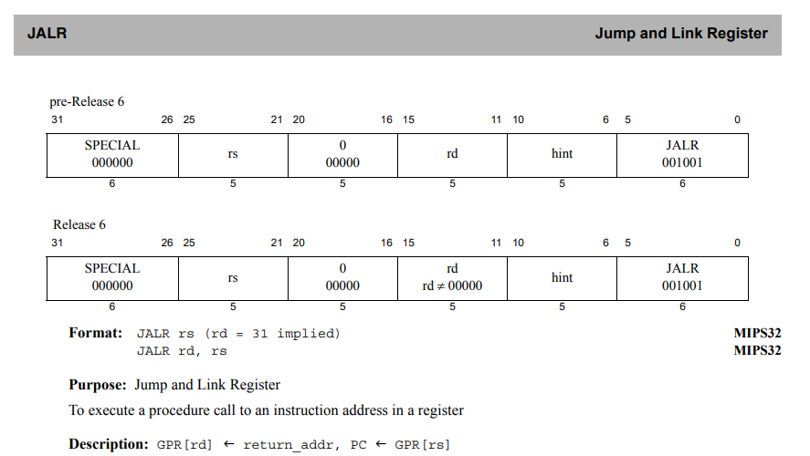

# Minisys Cross Compile

允许使用gcc/as从汇编或者c语言交叉编译到Minisys指令集上

## 基础知识

1. GPR: General Purpose Register，通用寄存器
2. Assembly Idiom: 类似于伪指令，这一条指令会使用其他基本指令实现，但是某些字段会被设置成特殊值，如 `jr`, `beqz` 

## 交叉编译中 Minisys 和 MIPS32r6 的区别

### 1. jr & jalr

gcc 会把 jr 编译成 jalr， 并把 rd 设置成 5'b0，以此来实现不修改任何GPR

JALR: 

JR: 

### 2. Branch 指令

需要支持的指令：

## 参考资料

1.  MIPS32R6 ISA: https://www.mips.com/?do-download=the-mips32-instruction-set-v6-06
